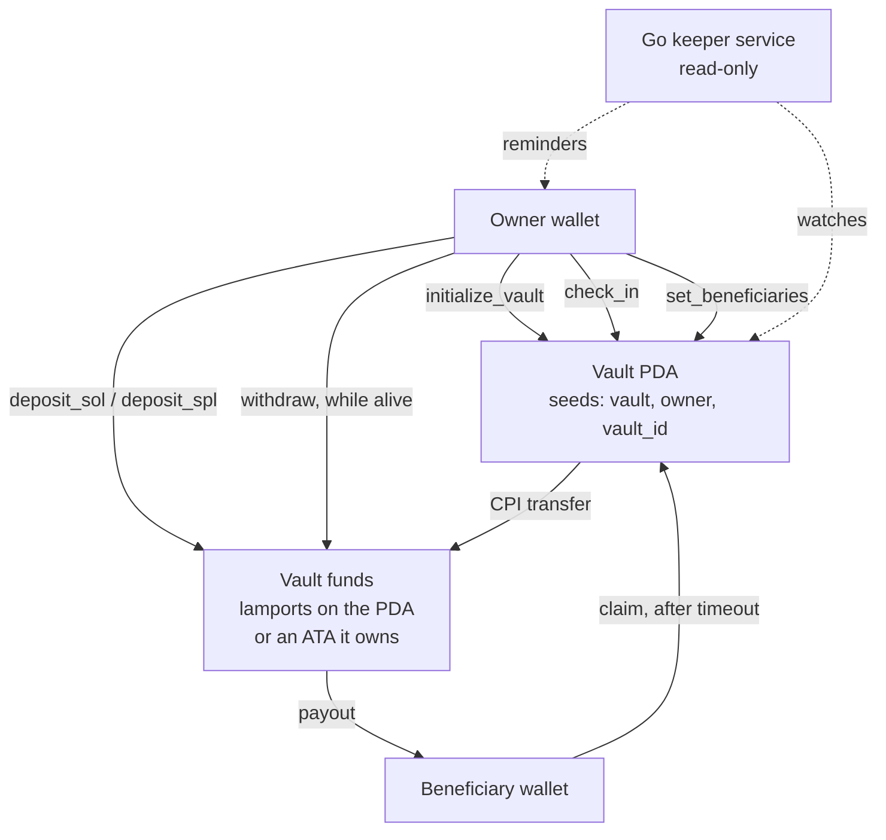

# Dead Man's Switch

**On-chain digital inheritance for Solana.** Lock SOL or SPL tokens in a vault, check in
every so often, and if you ever stop checking in, the people you named can take their
shares. No custodian, no oracle, no court.

**Live on devnet:**
[`9tfSr7zg9bGBfpSqqdwCACiSfAqsbdE4rNnwezFe5Ldm`](https://explorer.solana.com/address/9tfSr7zg9bGBfpSqqdwCACiSfAqsbdE4rNnwezFe5Ldm?cluster=devnet)

> 🚧 Work in progress. The program is deployed and feature-complete (76 tests), and the Go
> keeper and the Action server run against it (53 tests). A public host for the blink is
> next. See [Roadmap](#roadmap).


Nothing in that recording is staged: it runs against the deployed program, and every
signature it prints is on chain. Reproduce it with [`./scripts/demo.sh`](scripts/demo.sh),
or replay the raw capture with `asciinema play docs/demo.cast`.

## The problem

Self-custody has one failure mode nobody likes to talk about: the seed phrase dies with
you. Hardware wallets, multisigs and paper backups all assume someone else eventually
finds them and knows what to do with them — which is exactly the assumption that fails.

A dead man's switch flips the default. Instead of hoping someone finds your keys, the
chain itself hands the assets over — but only after you have been silent for a period
*you* chose.

## How it works



Three things make this work without a trusted operator:

- **The vault PDA owns the funds, not you.** For SPL tokens the vault's ATA has the PDA
  as its authority; for native SOL the lamports sit on the PDA itself. Either way only
  this program can move them.
- **`claim` is permissionless.** Each heir triggers their own payout the moment the timer
  runs out. If the keeper service is down, or the other heirs never show up, nothing
  stalls.
- **The timer is a single `i64`.** `last_checkin + timeout_seconds` versus the on-chain
  clock — read fresh inside the `claim` transaction itself, never cached.

The Go keeper is deliberately **not** in the critical path. It watches vaults and nags the
owner before a deadline, which solves the real UX problem ("I forgot to check in and lost
my assets"), but the protocol is correct whether or not it runs.

## State

### `Vault` — PDA, seeds `["vault", owner, vault_id]`

| Field | Type | Meaning |
| --- | --- | --- |
| `owner` | `Pubkey` | Wallet that funds the vault, checks in, and may withdraw while alive |
| `vault_id` | `u64` | Seed salt, so one wallet can run several independent vaults |
| `mint` | `Option<Pubkey>` | `None` → native SOL vault, `Some` → SPL token vault |
| `last_checkin` | `i64` | Unix timestamp of the last "I'm alive" signal |
| `timeout_seconds` | `i64` | How long silence may last before heirs can claim |
| `beneficiaries` | `[Beneficiary; 5]` | Fixed-size heir table |
| `beneficiary_count` | `u8` | How many slots are in use |
| `is_claimed` | `bool` | Set on the first successful claim — the switch has tripped |
| `claim_pool` | `u64` | Total the shares are divided over, snapshotted when the switch trips |
| `bump` | `u8` | PDA bump |

### `Beneficiary`

| Field | Type | Meaning |
| --- | --- | --- |
| `address` | `Pubkey` | Wallet allowed to call `claim` |
| `share_bps` | `u16` | Share in basis points; active slots sum to exactly `10_000` |
| `claimed` | `bool` | Whether this heir has already taken their share |

The heir table is a fixed-size array rather than a `Vec`: the account size is known at
`init`, so there is no `realloc`, no rent top-up, and no resize path to get wrong.

Two fields exist for reasons worth spelling out:

- **`claimed` is per heir, not per vault**, because each heir claims independently. Nobody
  has to coordinate with the others or wait for them to come online.
- **`claim_pool` freezes the total** at the moment of the first claim. Without it the split
  would silently be wrong: the second heir would take their percentage of whatever the
  first heir left behind, not of what the vault actually held.

## Instructions

| Instruction | Who | What it does |
| --- | --- | --- |
| `initialize_vault` | owner | Opens the vault: timer, heir table, asset |
| `deposit_sol` | owner | Moves lamports onto the vault PDA |
| `deposit_spl` | owner | Moves SPL tokens into the vault's ATA |
| `check_in` | owner | Resets `last_checkin` to now |
| `set_beneficiaries` | owner | Replaces the heir table, shares and all |
| `withdraw_sol` | owner | Takes lamports back out while the switch is armed |
| `withdraw_spl` | owner | Takes tokens back out while the switch is armed |
| `claim_sol` | any listed heir | Pays out one heir's share of a SOL vault |
| `claim_spl` | any listed heir | Pays out one heir's share of a token vault |
| `close_vault` | owner | Closes an empty vault and reclaims rent |

Three shapes here are deliberate and worth a sentence each.

**Assets are split into separate instructions** rather than branching on optional accounts
inside one. Two small account structs that each validate one thing are easier to audit
than one struct whose constraints only apply half the time.

**`set_beneficiaries` replaces the table instead of `add` / `remove`.** Shares must always
total exactly 100%, so adding or dropping one heir restates everyone else's share anyway.
An `add_beneficiary` would either have to leave the vault in an invalid intermediate state
or guess how to rescale the others. Restating the table makes every edit atomic and every
stored table valid.

**The owner keeps control until the first claim actually lands**, not merely until the
deadline passes. Being late is not the same as being dead: an owner who shows up overdue
but before any heir has moved can still check in or withdraw. An heir who moves first
wins — a race the owner avoids by checking in on time. From the first claim onward the
vault is frozen for the owner: no check-in, no deposit, no edits.

## Security invariants

1. **Only the owner can extend the vault's life.** If an heir could call `check_in` they
   could stall their co-heirs forever; if they could shorten the timer they could force an
   early payout.
2. **`claim` reads the clock inside its own transaction.** Checking a cached or
   client-supplied timestamp would open a race around a last-block check-in.
3. **SPL transfers always use `transfer_checked`**, which re-verifies mint and decimals
   on-chain and is the only variant Token-2022 accepts. Transfers *out* of the vault are
   CPIs signed by the vault PDA via `invoke_signed`, so the token program enforces the
   authority rather than this program asserting it.
4. **Native SOL never dips below the rent-exempt reserve.** `Vault::withdrawable_lamports`
   is the single place that decides what is movable; the reserve is not part of the
   claimable pool.
5. **Every sum and timestamp uses checked arithmetic.** `overflow-checks = true` is on for
   release builds as well, so an overflow aborts rather than wraps.
6. **A vault can only be closed once it is empty**, so no balance is ever orphaned.

## Try it on devnet

`dmsctl` drives a vault from the terminal — no browser, no TypeScript toolchain.

```bash
cd keeper && go build -o dmsctl ./cmd/dmsctl

./dmsctl open     --id 1 --timeout 30d --heir <pubkey>:7000 --heir <pubkey>:3000
./dmsctl deposit  --id 1 --sol 0.2
./dmsctl check-in --id 1
./dmsctl status
./dmsctl claim    --vault <address> --wallet heir.json
```

A full cycle recorded on devnet, on a vault with a two-minute timer and a 60/40 split:

| | before | after | change |
| --- | --- | --- | --- |
| vault | 0.10208788 SOL | 0.00208788 SOL | −0.1, leaving exactly the rent reserve |
| heir A (60%) | 0.05 SOL | 0.109995 SOL | **+0.06** less the transaction fee |
| heir B (40%) | 0.05 SOL | 0.089995 SOL | **+0.04** less the transaction fee |

### As a link

The same two actions are served as a [Solana Action](https://solana.com/docs/advanced/actions),
so a check-in is one tap from a link, a QR code or a feed rather than a terminal:

```bash
go run ./cmd/blink        # needs a public HTTPS origin to be reachable by a client
```

```
GET  /actions.json                          maps this domain to the API
GET  /api/actions/check-in?vault=<address>  the card, filled from live vault state
POST /api/actions/check-in?vault=<address>  → an unsigned transaction
GET  /api/actions/claim?vault=<address>     disabled, with the reason, until the deadline
POST /api/actions/claim?vault=<address>     → an unsigned transaction
```

The server holds no keys and signs nothing — it hands the unsigned transaction to the
user's wallet, which is the only thing that ever sees a private key. Against the live
devnet vault the card reads:

> Vault `5uyK…vFuQ` unlocks for its 2 heir(s) in 29 days, on 2026-10-22 06:49:26 UTC.

and the transaction it returns simulates clean on devnet:

```
Program log: Instruction: CheckIn
Program log: check-in at 1790062914; heirs unlocked from 1792654914
Program 9tfSr7zg9bGBfpSqqdwCACiSfAqsbdE4rNnwezFe5Ldm success
```

Checks the server makes before handing over a transaction — that you own the vault, that
you are a named heir, that the deadline has passed — are **not** security. The program
enforces every one of them on chain. They exist so the user is told why before they sign,
rather than watching a transaction fail in their wallet.

### As a watcher

The keeper watched the claim happen — one `due_soon` warning, silence for three scans,
then one `expired` warning the moment the deadline passed, and silence again:

```
msg="scan complete" vaults=2 reminders=1
msg="vault needs attention" status=due_soon time_left=50.7s
msg="scan complete" vaults=2 reminders=0
msg="scan complete" vaults=2 reminders=0
msg="vault needs attention" status=expired  time_left=-8.9s
msg="scan complete" vaults=2 reminders=0
```

## Build and test

Requires the Solana toolchain — on Windows, run everything inside WSL.

```bash
anchor build
cargo test
```

Tests run against [LiteSVM](https://github.com/LiteSVM/litesvm): a real SVM in-process, no
validator and no network. `anchor build` must run first, since the tests load the compiled
`.so`.

`test_golden_layout.rs` is the odd one out: it writes the `Vault` account bytes to
`keeper/testdata/` and the Go keeper's tests read them back. Two languages, one byte
layout, both checked in CI — change the account and both sides fail until they are updated
together. Regenerate with `UPDATE_GOLDEN=1 cargo test --test test_golden_layout`.

One file per instruction, 73 tests in total:

```bash
cargo test --test test_claim_sol
cargo test --test test_close_vault
```

Time is a first-class input here, so the harness drives the SVM clock directly
(`advance_clock`) rather than sleeping. A thirty-day timeout is tested in milliseconds.

## Layout

```
programs/dead-man-switch/   Anchor program
  src/instructions/         one file per instruction
  tests/                    LiteSVM integration tests
keeper/                     Go services and tooling
  cmd/keeper/               the watcher daemon — reads only, holds no keys
  cmd/dmsctl/               CLI that signs: open, fund, check in, claim
  internal/dms/             hand-written account decoder + RPC reader
  internal/watch/           scan loop and reminder thresholds
  cmd/blink/                Solana Action server — check in or claim from a link
  internal/api/             read-only HTTP index
  internal/blink/           the Action endpoints and their spec types
  testdata/                 golden account bytes, written by the Rust tests
scripts/demo.sh             the lifecycle above, start to finish, on devnet
docs/                       the recording
```

The [keeper](keeper/README.md) is a read-only service — it holds no keys and signs nothing.
It watches vaults, warns owners before a deadline, and serves an index of what it sees. The
protocol is correct with the keeper switched off; it exists to solve the UX problem the
protocol creates.

## Roadmap

- [x] Vault state, `initialize_vault`, `deposit_sol`, `deposit_spl`
- [x] `check_in`, `set_beneficiaries`
- [x] `claim` with share splitting, `withdraw`, `close_vault`
- [x] Go keeper: vault monitoring, deadline reminders, REST index
- [x] Devnet deploy, `dmsctl`, full cycle run on-chain
- [x] Solana Action / Blink for `check_in` and `claim`
- [x] Recorded demo of the full lifecycle on devnet
- [ ] Public host for the blink
- [ ] Fuzzing over amounts and timestamps

## License

MIT
